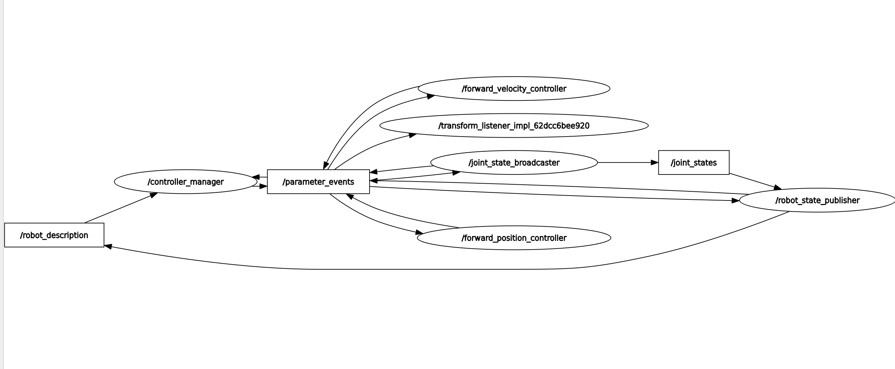

# ROS2 control

The functional architecture of ROS2 control

internal implementation of the ros2_control framework.

### **Summary:**

- **URDF** defines the robot structure, joints, sensors, and actuators.(.XML file)
- **Hardware Interface** (C++) abstracts the actual hardware interaction (sensors, actuators).
- **Controller Manager** loads controllers and links them to hardware interfaces.
- **Controllers** implement the logic to control the robot (e.g., position controllers).
- **Python code** can be used to interface with the controllers, send commands, or monitor the state.

### How does The ROS2 control work in practice?

- **Controller Manager** and **plug-in system** take care of loading and instantiating the hardware interface at runtime based on the **URDF configuration** and the **hardware plug-in** you define.

- **Controller Manager** manages:

  - Loading the hardware interface

  - Activating and setup controllers(**Create controller instances** )

  - Making the connection between **hardware interfaces** (such as joints, sensors) and **controllers**.(Create hardware instances)
  - Manage the lifecycle of these controllers

the exemplary topic/node graph in demo example3.

you can see , here based rqt ROS topic/node graph, we get a breakdown of how the system communicates internally to achieve its goal of controlling a robot.

### Node and Topic Communication

1. **`/robot_description`**: This is a key piece of static information, likely a **topic** containing a Unified Robot Description Format (URDF) file. The URDF describes the robot's physical structure, joints, and links. The `/controller_manager` subscribes to this topic to understand the robot it needs to control.
2. **`/controller_manager`**: This is a central **node** that manages all the controllers for the robot. It's responsible for loading, unloading, starting, and stopping the controllers. It gets its understanding of the robot from the `/robot_description` topic.
3. **`/parameter_events`**: This is a crucial **topic** for dynamic communication. It's used by nodes to signal changes in their parameters. In this graph, many nodes subscribe to this topic, meaning they can react to parameter changes in real-time. For example, a controller's tuning parameters could be updated on the fly. The `/controller_manager` also publishes to this topic, likely to broadcast information about which controllers are active.
4. **Controllers**: There are three specific controllers shown, all subscribing to `/parameter_events`:
   - **`/forward_velocity_controller`**: This node likely commands the robot to move at a specific velocity.
   - **`/forward_position_controller`**: This node commands the robot to move to a specific position.
   - **`/joint_state_broadcaster`**: This is a special type of controller that's responsible for publishing the current state of the robot's joints. It publishes to the `/joint_states` topic.
5. **`/joint_states`**: This is a vital **topic** that contains the position, velocity, and effort of each joint on the robot. The `/joint_state_broadcaster` publishes to this topic, and the `/robot_state_publisher` subscribes to it.
6. **`/robot_state_publisher`**: This **node** is responsible for broadcasting the robot's transformation tree, which is a representation of how the various links of the robot are related in space. It uses the `/joint_states` to calculate the transforms and publishes this information.
7. **`/transform_listener_impl_...`**: This node, likely an implementation of a TF (Transform) listener, subscribes to the transforms published by the `/robot_state_publisher` and makes them available for other nodes to query.

In essence, the system works by having a central manager(**A process! in essential**) load the necessary controllers. The controllers then take input (possibly from other topics not shown) and command the robot.(**Hence, you will see names like `/forward_velocity_controller`. This is because the `controller_manager` creates a separate executor and namespace for each controller, effectively treating them as individual nodes on the rqt graph. **) The `/joint_state_broadcaster` reads the robot's actual joint positions and velocities, publishing them to the `/joint_states` topic. The `/robot_state_publisher` then takes this joint state information and publishes the robot's full kinematic state, which is consumed by the TF listener and likely other nodes for navigation, visualization, or manipulation tasks. The `/parameter_events` topic acts as a central hub for dynamic configuration changes. (**Other processes are made when: you (user) gives a ros2 client**)
