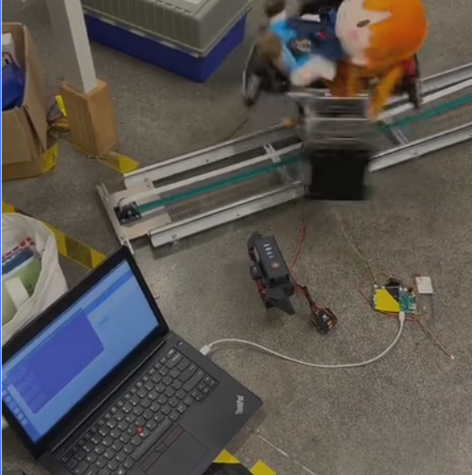
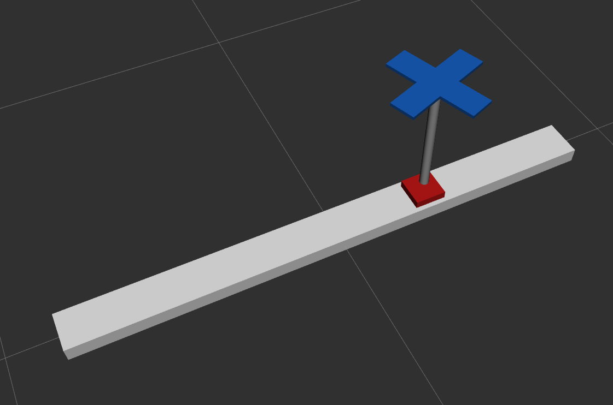

# Full tutorial for writing a controller & organizing a project of ROS2 control

> "ros2_control is a realtime control framework designed for general robotics applications. Standard c++ interfaces exist for interacting with hardware and querying user defined controller commands. These interfaces enhance code modularity and robot agnostic design. Application specific details, e.g. what controller to use, how many joints a robot has and their kinematic structure, are specified via YAML parameter configuration files and a Universal Robot Description File (URDF). Finally, the ros2_control framework is deployed via ROS 2 launch a file."
>
> This tutorial will guide you to develop a toy project with some parts copied from already written projects.  Your task is to organize a project and write a controller by yourself.

## get ready!

If you have not read the source code, please read them first.

You are expected to at least have a clear understanding of the header files, but it would be better if you make a dive the `.cpp` files for detailed implementation.

### read official tutorials

1. Watch demo7 in ros2_control official website , which is a full guide apt to green hands.

2. look through the official tutorial for the passages below:

https://control.ros.org/humble/doc/ros2_controllers/doc/writing_new_controller.html 
https://control.ros.org/humble/doc/ros2_control/hardware_interface/doc/writing_new_hardware_component.html

3. **[extra]** : if you want to have a larger DIY for your toy controller, review these files in ROS2

https://docs.ros.org/en/humble/Tutorials/Beginner-Client-Libraries/Custom-ROS2-Interfaces.html
https://docs.ros.org/en/humble/Tutorials/Beginner-Client-Libraries/Single-Package-Define-And-Use-Interface.html#use-an-interface-from-the-same-package
https://docs.ros.org/en/humble/Tutorials/Beginner-Client-Libraries/Writing-A-Simple-Cpp-Publisher-And-Subscriber.html
**review the method implementing broadcast the state and offer reference interface in demo7, please take care of the concept of QoS.**

These might do some help when you are writing a node to communicate and instruct the behavior of the controller. (You are assumed to create a topic and send message later)

### read the example controllers in decomposition

1. Read the recommended controllers in the meta-ros, which can help you to get accustom to the specific context of developing our team's project:

https://github.com/Meta-Team/Meta-ROS/tree/master/decomposition/meta_chassis_controller ,  https://github.com/Meta-Team/Meta-ROS/tree/master/decomposition/meta_gimbal_controller ,  https://github.com/Meta-Team/Meta-ROS/tree/master/decomposition/meta_shoot_controller  特别看gimbal controller!  结合meta云文档, 学起来更轻松!


2. Read the hardware interfaces that are needed for your development. They should be(Since the principle are same, so I list files correlated to dji-motor only.)

   ```
   src/meta_hardware/include/meta_hardware/dji_motor_interface.hpp
   src/meta_hardware/include/meta_hardware/motor_driver/dji_motor_driver.hpp
   src/meta_hardware/include/meta_hardware/motor_network/dji_motor_network.hpp
   src/meta_hardware/src/dji_motor_interface.cpp
   ```

   Keep this question in your mind as you reading: what is the interface like in earth and what properties are exposed or controlled for the motors?

- Concentrate on the header files, the source code are not that crucial, and added only for your extra exploration.

**Some knowledge you should have before you start to get your hands dirty:**

- all the launch files are in `meta_bringup` , to stay coherent, you should add your `launch.py` here.
- As for the `.yaml` file for the controller manager to take in and spawn your controller, they should be in `config` folder
- all the controllers that deals with hardware interface should be in decomposition folder , so create a package for your controller here.
- what is more, your package (controller) should at least contain `yourpackage.xml`, which specify the share lib file you export and the `description folder` for urdf as well as hardware and the `include + src` folders.


> (Bonus)In order to make your job easier, here is my personal preparation and aims:
>
> 1. review **topic/message** + reference generator/state broadcaster of **demo 7** + ask AI for QoS in ROS2
>
> 2. probe into the **meta hardware** for your to manipulate the **hardware interface**, make notes for it.
>
> 3. **Gimbal controller** study, how to write a controller.
>
> 4. look through **demo 1 and 3** for how to structure a project of ROS
>
>    also : mimic their way of writing hardware description file&rviz render + launch file + controller + package/cmakelist regulation.
>
> After that, before you start coding, answer these question:
>
> how is reference interface delivered and to whom it is offered?
>
> how to write your vision description URDF file? Can you write it with the help of AI?
>
> what should the launch file be like for your project? Can you write it with the help of AI?
>
> What hardware interface is leveraged by your controller?

## start coding!

After you finished the first part of the tutorial, it's no doubt that you have the capacity to accomplish a project on your own. This is the most difficult part, but we will forge through it together. Here is my advice: Be brave, and break your work down into simple, tiny tasks so you can overcome them one by one.

### create the package and configure your editor

> 如果你觉得直接在meta-ros 环境中开发一开始太复杂,可以自己新建一个workspace, 弄好了再split and stuff回去.

First create a package:

```
ros2 pkg create --build-type ament_cmake --license Apache-2.0 meta_armor_tester \
  --dependencies controller_interface hardware_interface pluginlib rclcpp rclcpp_lifecycle
```

The necessary(most basic) dependencies are added.

Let's create files! In `include/<PACKAGE_NAME>/` folder add `<controller_name>.hpp` and `<controller_name>.cpp` in the `src` folder.

我写的是一个移动装甲板控制器, 具体像这样:



大概思路就是,在目前框架的decomposition层下面写一个ros2controller plugin 来控制整个移动装甲板(就只有两个电机,一个宇树Go1电机作为Yaw轴, 一个DJI M3508作为平动控制)

整个包叫做meta_armor_tester,为了方便,我们就把控制器的名字叫做`armor_plate_controller` 吧. 

根据之前的阅读,你应该已经知道了:

我们将新建了一个meta_hardware package.复制自:

```text
execution/meta_hardware/
Recommended: delete the unnecessary files (also edit cmakelist) leave only can driver + dji + unitree motor for clarity
(Important)Some packages also need to duplicate:
execution/relay_serial/
execution/motor_controllers/
src/tools/
These are necessary dependency files to set up CAN protocol,translate the bits from CAN into usable data in your program.
```

在meta_armor_tester package中,新建:

- 一个description 文件夹, 里面装你的urdf xacro files

- 一个bringup folder(这和meta-ros主项目的文件分布不同,不过没关系,为了学习+更方便diy ,就这样吧) 里面创建armor_ plate_controller.launch.py  and send_motion_instruction.launch.py(for further tuning)


最后大概是这个样子:


好的, 基本的文件已经放好, 开始实践!

> 备注: 为了更好的代码体验,把你的ide检查 cpp标准改成c++20!如果你使用clangd作为检查工具,把`Diagnostics:UnusedIncludes: None`加到`.clangd`中去, 减少不正常报错.
>
> 编译用命令`colcon build --symlink-install --cmake-args -DCMAKE_EXPORT_COMPILE_COMMANDS=ON` ,会生成一个`compile_commands.json` 文件, 把它加入到setting.json of .vscode directory:   `"C_Cpp.default.compileCommands": "${workspaceFolder}/build/compile_commands.json"`. 确保your IDE不乱报错.

### tackle hardware interface + robot description file

create a .xacro file for our armor plate for simulation!


let me do some theoretical explanation first:

With rosidl, you can create a customized msg yourself and then you construct a node to publish/subscribe the topic(which is in essence a message transmitted using DDS with QoS). Ok, with that in your mind, think about the control logic in demo 7: it use a open loop control method, designing the ideal velocity and position in the trajectory and assign them to the controller,Where send_trajectory node publishes the trajectory message and the r6bot_controller receives it. Admittedly , the control logic is naive but the implementation of topic and sending reference are same in everywhere. 


一些实战中你可能遇到的疑问: 

1. hardware是怎么正确被识别并分发给controller的,只靠不同的joint name吗? 我看了meta_hardware的代码后产生的认知是, dji的所有电机被整合成为一个system, unitree的所有电机被整合成一个hardware. 那么,但我们有多个system 和多个joint时, 是怎么确保controller能够正确的得到相应的system下面的joint的command/state interfaces的? 

   通过阅读源码, 我们已经知道了command/state interface是一个 (joint_name + interface_name + value pointer)的结构体, 也知道controller manager通过yaml里的信息正确地调用spawner这个节点来创建controller. 

   答: 是的.即使它们属于不同的 `<ros2_control name="xxx">` 区块（不同 system），所有 joint 的名字在整个机器人 URDF 范围内 **都必须唯一**。所以 ROS2 Control 的设计哲学是：

   > “joint 名称是全局唯一的逻辑标识符，不管你有多少个 system。”

2. hardware是再那里被创建的? 我们似乎再launch file中没有找到. 是通过controller manager这个node下面的`remappings=[("~/robot_description", "/robot_description"),],` 来创建hardware_interface? 

   答: 在 `controller_manager` 启动时，由内部的 `hardware_interface::ResourceManager` 根据 URDF `<ros2_control>` 标签自动加载对应的 hardware plugin。launch 文件不会显式写出它，只需提供 `robot_description` 即可。`controller_manager` 只是一个 ROS 2 节点（叫 `ros2_control_node`）， 它**从自己的参数读取参数**, remapping是为了只是为了**参数命名空间对齐**.

   简单来说,总结全流程:

   1. 你通过 launch 启动 controller_manager：
      - 它读取 `robot_description`；
      - 内含 `<ros2_control>` 标签；
      - 含有多个 `<ros2_control name="...">` hardware 块；
   2. controller_manager → 创建 `ResourceManager`；
   3. ResourceManager → 解析 URDF → 加载 hardware plugin；
   4. hardware plugin → 注册 joint interfaces；
   5. controller_manager → 启动 spawner；
   6. spawner 根据 yaml 里的 controller 配置创建 controller；
   7. controller_manager → 把 controller 请求的接口和 hardware 的接口匹配；
   8. 最后形成完整的数据流。

   写好description files, 这是配置好了之后的结果图:

   

> 备注:第一次用rviz注意把robotmodel 的topic设置为/robot_description! 这个topic是由joint broadcaster通报给rviz用于渲染的信息. 不然一片空白/漆黑.
>
> - 写urdf的时候, 学会用macro 和 include. 注意这个include的context: 再colcon build之后, install/package/share/package之中. 此外, macro 的param再多个的时候要用复数, params. Keep in mind that the name of joint for visual description and ros2_control should align.
>
> - hardware 的 state/command interface ("position","velocity")在哪里看? 你怎么知道它给的是这个?看export_state_interface, export_command_interface 这个函数,你会发现, 它返回的是一个interface的数组, 给出(joint_name, interface_name, value_ptr). 至于value_ptr, 我们只需要知道,它与driver有关-- 更加底层的driver实现的是正确从硬件中把bits读取转换成double value, 或者把写入的double值(通过value_ptr修改),翻译并传输给硬件.于是我们就知道在URDF ros2_control文件中要joint下面写什么了.
>
> - 所有plugin的namespace名称都应该是对应package name 吗?不是的.只要namespace和package_name.xml 中type项的前缀一样就行. 此外,package_name.xml 中name项的前缀是package_name
>
> - 在cmakelist里面加上下面一段来正确install
>
>   ```cmake
>   install(
>     DIRECTORY description/launch description/ros2_control description/urdf
>     DESTINATION share/meta_armor_tester
>   )
>   ```

### writing a controller!

- ros2 复杂的文件以及配置是所有开发者的不得不克服的一座大山, 让我们在这一节中, 克服它吧!
- 看战队的资料:[如何写一个controller](https://l5595ex0wg.feishu.cn/wiki/C5oxw45J3i5r2WkQePnczGbAnme?fromScene=spaceOverview) 如果你比较厉害,看了它,足矣.
- There is 4 stage of writing a controller, configure it, fill out the main hpp/cpp files, and write a launch file for it.

Question:

Now that We have 2 registered system dji_motor and unitree_motor , with joint name of slide_joint and rotate_joint.

Currently we are gong to configure a .yaml for the controller as well as controller manager.

there a multiple approaches, but in general can be divided into 2 category.


#### Comparison of Approaches

| Feature                 | Approach 1: Auto-Declare in C++                              | Approach 2: YAML Parameter Listener                          |
| ----------------------- | ------------------------------------------------------------ | ------------------------------------------------------------ |
| **Joint Configuration** | Defined in the **controller's C++ code** using `auto_declare` or similar methods (like `declare_desired_interfaces`). | Defined in a **separate, detailed controller YAML** file, accessed via a Parameter Listener or `get_param()`. |
| **YAML Complexity**     | **Simpler**, primarily listing the controller type and name in the `controller_manager` section and repeating the joints/interfaces under the controller's namespace for external configuration. | **More complex**, requiring detailed parameter declarations (type, default, description) in one file, and the actual values in a separate launch/bringup YAML file. |
| **Flexibility**         | Good for **standard interfaces** (position, velocity, effort). Less flexible for complex, non-standard configuration data. | **Highly flexible** for complex, custom parameters (e.g., PID gains, custom thresholds, sensor topics, control mode settings) beyond basic joint lists. |
| **Maintainability**     | **Easier** for simple joint-based controllers. Joint names are centralized in the configuration YAML for quick changes. | **More effort** to maintain, as it involves both a configuration definition and an instance value definition. |
| **Standard Practice**   | Common for **standard controllers** like `JointPositionController`, or custom controllers where the configuration is primarily the list of joints and interfaces. | Common for **complex custom controllers** where many different parameters (like the PID gains and sensor topics in your example) need to be configured. |

the different usage of 2 yaml files:

| Layer                                                       | File                                                         | Function                                                     |
| ----------------------------------------------------------- | ------------------------------------------------------------ | ------------------------------------------------------------ |
| **Parameter Definition**                                    | `armor_plate_controller_parameters.yaml`                     | Declares parameters, types, and default values (used by generator). |
| **Runtime Parameter Values**                                | Controller Manager YAML (`armor_tester_controller.yaml`)     | Supplies actual values for those parameters (used by controller at startup) |
| **Effect of `command_interface` / `state_interfaces` here** | They **tell your controller** which interfaces to claim from hardware — e.g., use position commands and read position + velocity states. | If specified for controller manager, ROS 2 populates your controller node’s parameter tree with those values deliberately. |

In this tutorial , to  challenge ourselves , we choose **approach 2** + a ParamListener class.

First, write 2 .yaml file for your project, one for controller, and the other for controller manager.

Next, modify the Cmakelist and package.xml , with some effort , I believe you can achieve it.

#### chainable controller

Then, let's write a chainable controller!

Having some necessary realization for chainable controllers will supplements your code experience:

> In ROS 2 `ros2_control`, **classic controllers** and **chainable controllers** handle interfaces slightly differently.

- A chainable controller is a **controller that can be “fed” by another controller**, rather than directly from hardware or topics.
- You **still need your hardware interfaces**, but the **chaining logic separates “input” from “output”**:

| Special Virtual Functions             | Meaning                                                      |
| ------------------------------------- | ------------------------------------------------------------ |
| `on_export_reference_interfaces()`    | Export the **input interfaces** that other controllers can write to you when you are chained. These are **internal references**, stored in `reference_interfaces_`. |
| `update_reference_from_subscribers()` | When **not chained**, you read from ROS topics or services to fill `reference_interfaces_`. |
| `update_and_write_commands()`         | Compute outputs from `reference_interfaces_` and write to hardware command interfaces (just like normal controller). |

- You **still export your hardware interfaces** if you control actuators/systems:

```cpp
std::vector<hardware_interface::CommandInterface> export_command_interfaces() override
{
    return {hardware_interface::CommandInterface("joint1", "effort", &joint1_cmd)};
}
std::vector<hardware_interface::StateInterface> export_state_interfaces() override
{
    return {hardware_interface::StateInterface("joint1", "position", &joint1_pos)};
}
```

- The **difference** is that the “reference inputs” are separate (`reference_interfaces_`) and can be either:
  - Written by a **previous chainable controller**, or
  - Filled by **subscribers** if this controller is at the start of the chain

**`update()`**: The real-time control loop calls this. Already `final` in the base class, so you **don’t override it**.

In our scenario, we will NOT set the controller in a chained mode, considering the fact that we have only 1 controller, and it will receive reference by subscribing to topics outside.


Now focus on your job.

#### the methods to override

First I list out the lifecycle -related methods

| Method                                                       | Purpose                                             |
| ------------------------------------------------------------ | --------------------------------------------------- |
| `controller_interface::CallbackReturn on_init()`             | Initialize parameters, allocate vectors, etc.       |
| `controller_interface::CallbackReturn on_configure(const rclcpp_lifecycle::State &)` | Set up subscribers, internal data, etc.             |
| `controller_interface::CallbackReturn on_activate(const rclcpp_lifecycle::State &)` | Get hardware interfaces ready, reset commands, etc. |
| `controller_interface::CallbackReturn on_deactivate(const rclcpp_lifecycle::State &)` | Cleanup or stop sending commands.                   |

as your controller directly deal with motors, the hardware related methods

| Method                                                       | Purpose                                                      |
| ------------------------------------------------------------ | ------------------------------------------------------------ |
| `std::vector<hardware_interface::CommandInterface> export_command_interfaces() override;` | Expose command handles to the hardware (e.g. effort or position for `slide_joint` and `rotate_joint`). |
| `std::vector<hardware_interface::StateInterface> export_state_interfaces() override;` | Access feedback state handles (e.g. position, velocity).     |

Last comes the chainable controller - specific methods, they are core for a chainable controller.

For now you’ll implement the **non-chained** version, but still need to define all of them.

| Method                                                       | Required? | Purpose                                                      |
| ------------------------------------------------------------ | --------- | ------------------------------------------------------------ |
| `std::vector<hardware_interface::CommandInterface> on_export_reference_interfaces() override;` | ✅         | Define your chainable *input* references (one per joint). For now, they’ll just exist but not used by another controller yet. |
| `controller_interface::return_type update_reference_from_subscribers() override;` | ✅         | Your main testing entry point: read reference values from ROS topics and store into `reference_interfaces_`. |
| `controller_interface::return_type update_and_write_commands(const rclcpp::Time &, const rclcpp::Duration &) override;` | ✅         | Compute motor commands from `reference_interfaces_` and send to hardware command interfaces. |
| `bool on_set_chained_mode(bool chained_mode) override;`      | Optional  | You can leave as default (`return true`) for now, or disable subscribers when chained later. |

> (BONUS):if you feel fatigue about tackle with all these arduous package/configuration, skip them for now. 
>
> Here I offer you a ready to write cpp& hpp file. Just implement ten TO - DO methods commented in the source file
>
> It's being tested, so you don't need to concern about anything else (it's now literally a common MP for you). JUST GO STRAIGHT CODING. EXCEED YOURSELF. Believe in yourself that you will grasp rest part of developing a ROS controller(project) later.
>
> here is the link:

## deploy + integration!

Let's deploy your armor_tester, and integrate them into the main project of Meta-ROS. If you have complete the former parts of this tutorial successfully, this is where you finalize this project and enjoy the magic of your work!


```
colcon build --symlink-install --cmake-args -DCMAKE_EXPORT_COMPILE_COMMANDS=ON
```

```
# some commands
source install/setup.bash
# first time run, setup the can wires
./tools/install.sh
# 1. setup can
./tools/setupcan.sh
# 2. check can device number connected PC connection
ip adress
# or ip a for short
# 3 . check RS485 and UART connection
ls /dev/tty_*
# 4. launch the node
ros2 launch meta_armor_tester armor_tester.launch.py
ros2 run meta_armor_tester ref_generator
```

also, as the tutorial implementation is independent of what is in the project, see how the codes are integrated in our Github repository: https://github.com/Meta-Team/Meta-ROS/pull/16/files
